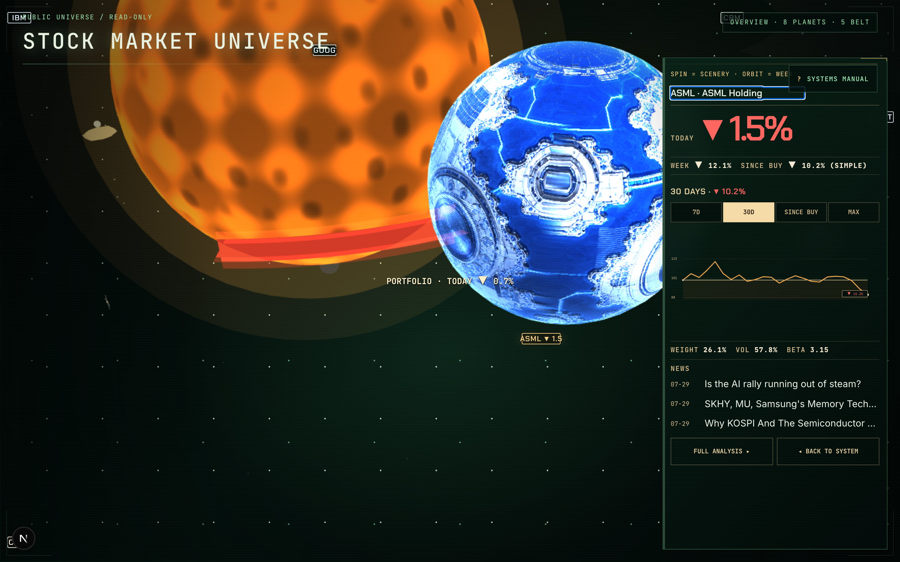
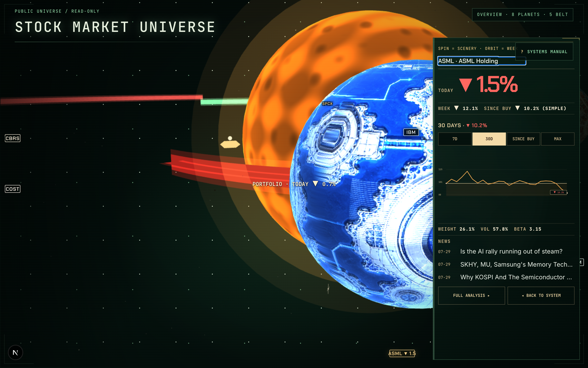
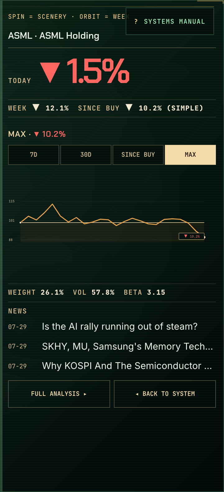
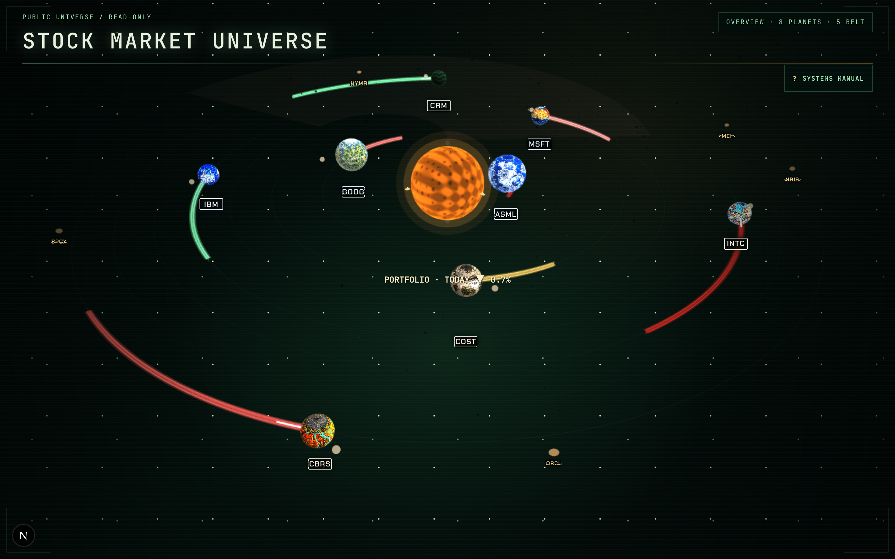

# §11 contact sheet

Captured 2026-07-29 · 1440×900 @2x · `http://localhost:3000/share`
Public route — owner-only fields (dollar amounts) are absent by design.
Harness: `npm run phase10:capture -- --section 11`

Owner reviews this sheet and his responses are transcribed into
`OWNER_FEEDBACK_LEDGER.md` as CONFIRMED or regressed rows. A row closes on
his sentence or a committed capture — never on a criteria-ledger pass.

---

### overview

OVERVIEW at 1440×900 — trail arc length (FB-03), planet spacing (FB-01), overall composition

### asml-selected

ASML selected — planet anchor position, dead space on the left (F2 / FB-07)

### asml-panel-type

ASML panel, full height — five-token type ramp and small-font legibility (F1 / FB-05), panel width (FB-17)

### asml-approach-mark

ASML at approach scale — is a brand mark legible on a selected planet? (F3 / FB-04, camera and exposure only, no texture regeneration)

### range-since-buy

ReturnInstrument, SINCE BUY detent — compare against the next frame (F4 / BHV-15)

### range-max

ReturnInstrument, MAX detent — the two paths must differ (F4 / BHV-15)

### news-links

NEWS headlines — each must be a real anchor to the article (FB-10)

### correlation — NOT CAPTURED

CORRELATION section — does the prose say what it means for HIS book? (FB-11)

> Failed: locator.scrollIntoViewIfNeeded: Timeout 5000ms exceeded.

What was on screen instead (not evidence, diagnosis only):

---

7/8 captured.
**1 failed — this sheet is incomplete and cannot support acceptance.**
