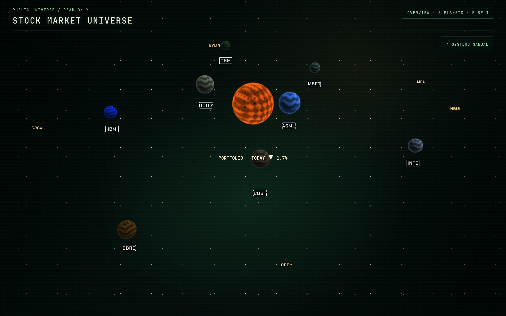
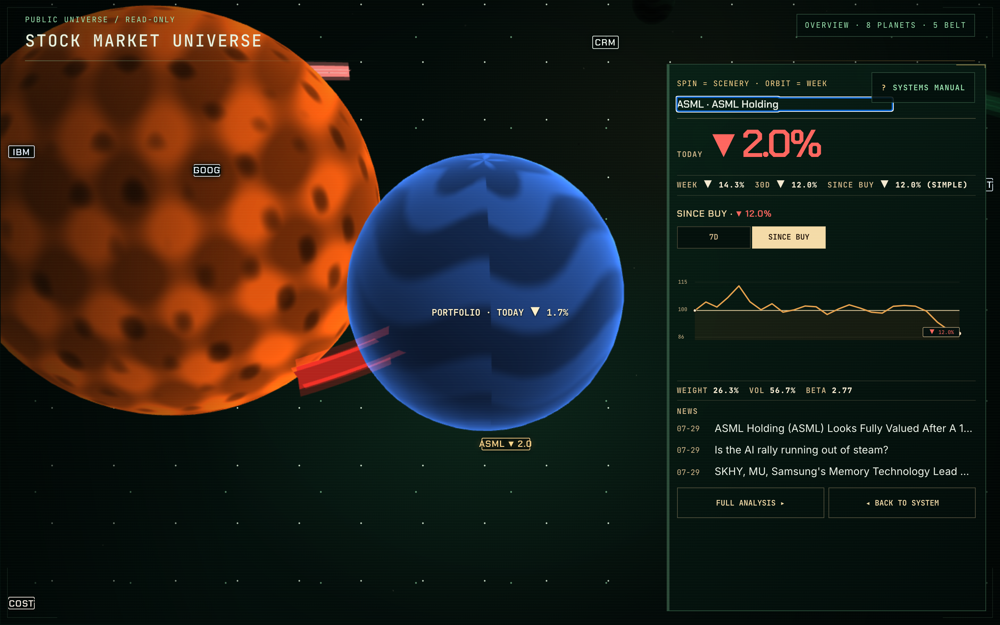
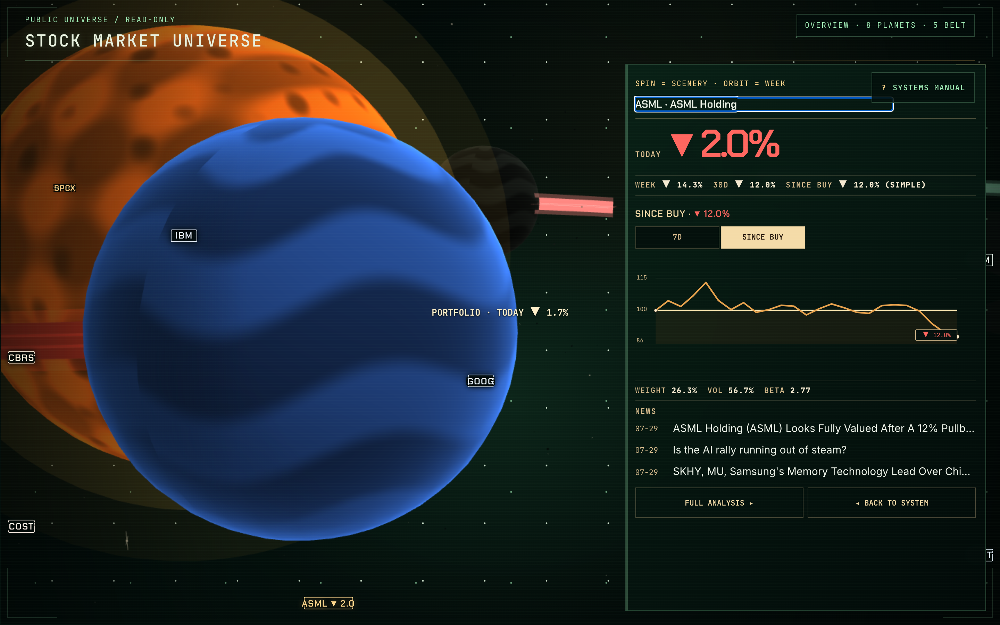
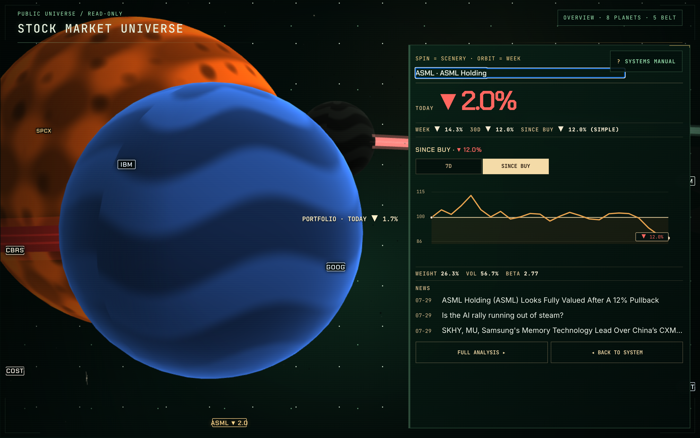
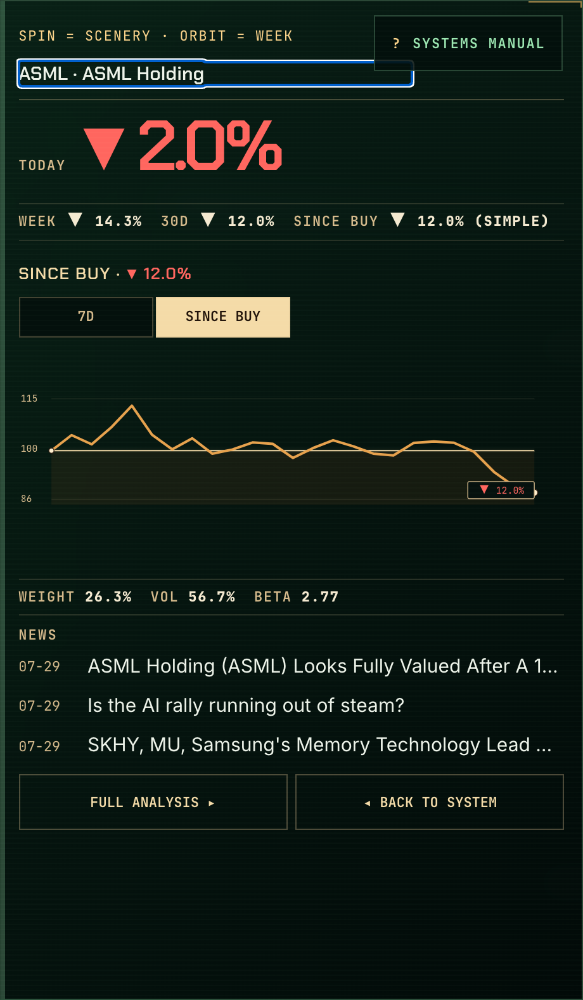
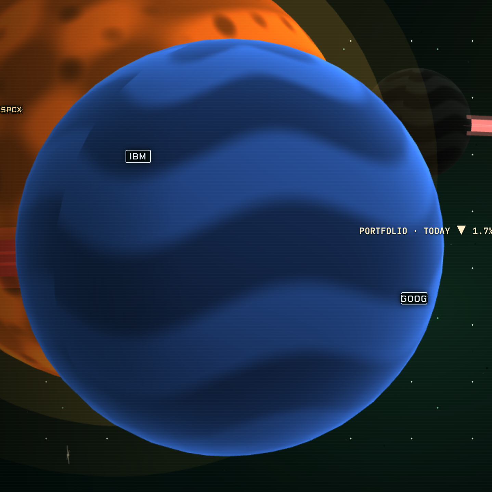
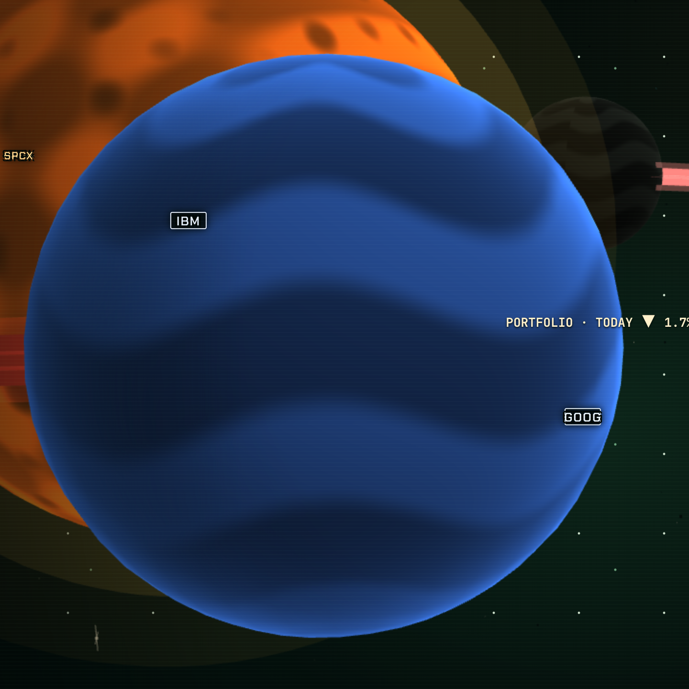
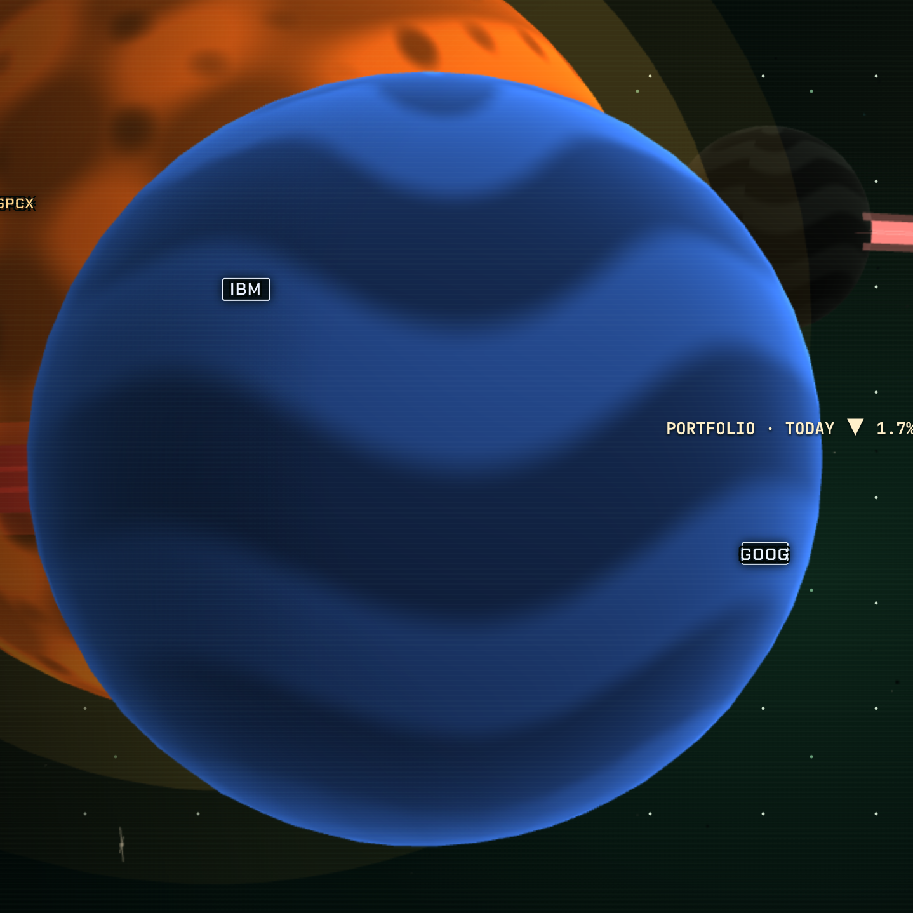
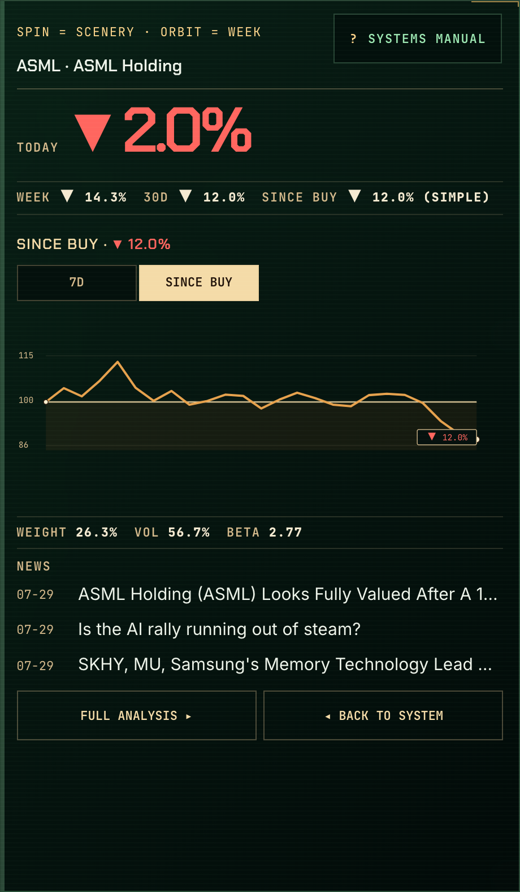
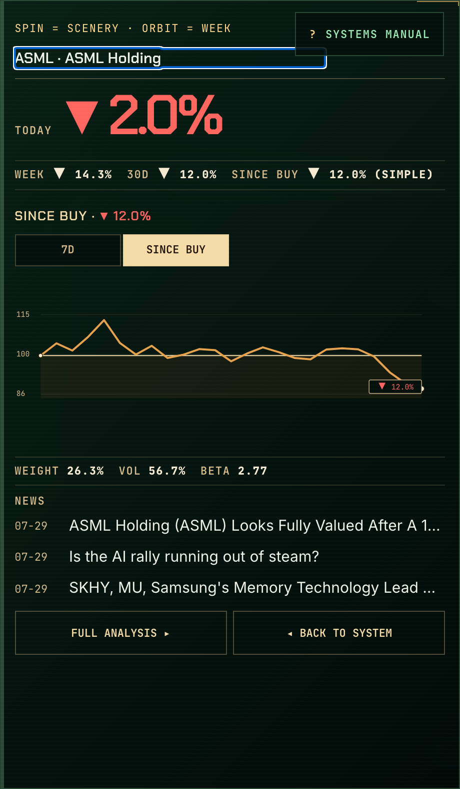

# §11 contact sheet

Captured 2026-07-30 · 1440×900 @2x · `http://127.0.0.1:3000/share`
Public route — owner-only fields (dollar amounts) are absent by design.
Harness: `npm run phase10:capture -- --section 11`

Owner reviews this sheet and his responses are transcribed into
`OWNER_FEEDBACK_LEDGER.md` as CONFIRMED or regressed rows. A row closes on
his sentence or a committed capture — never on a criteria-ledger pass.

---

### overview

OVERVIEW at 1440×900 — trail arc length (FB-03), planet spacing (FB-01), overall composition

### panel-width-460

ASML selected with a 460px left-growing rail — measured left-third planet anchor and disc/panel gap (F2 / FB-07, FB-17)

### panel-width-520

ASML selected with a 520px left-growing rail — owner width choice, same measured left-third planet anchor (F2 / FB-07, FB-17)

### panel-width-580

ASML selected with a 580px left-growing rail — owner width choice, same measured left-third planet anchor (F2 / FB-07, FB-17)

### asml-panel-type

ASML panel, full height at the default 460px — five-token type ramp legibility (F1 / FB-05) and simple information density (FB-17)

### asml-mark-phase-0

ASML approach at authored mark phase 0° — camera/exposure-only visibility check (F3 / FB-04, VIS-02, DEF-02)

### asml-mark-phase-120

ASML approach at authored mark phase 120° — second of the three authored longitudes (F3 / FB-04, VIS-02, DEF-02)

### asml-mark-phase-240

ASML approach at authored mark phase 240° — third authored longitude, no texture regeneration (F3 / FB-04, VIS-02, DEF-02)

### range-since-buy

ReturnInstrument, SINCE BUY detent — distinct window and shape; dead MAX is absent when no older history exists (F4 / BHV-15)

### news-links

NEWS headlines — each must be a real anchor to the article (FB-10)

---

10/10 captured.
Complete.
