# §12a contact sheet

Captured 2026-07-30 · 1440×900 @2x (mobile frame 390×844) · production build,
this candidate (`2390059473ad2a0da2b64ee7a9ecce35d5e532b1`).
Public `/share` route unless captioned otherwise. Owner-only fields (dollar
amounts, DRAFT) are absent from the public captures by design.

This section closes eleven already-answered ledger rows, not a new question.
Two of them (`FB-19`, `FB-20`) close on capture alone — no owner sentence is
needed, and they are documented here for completeness, not as sitting
questions. The remaining nine ask Devan to look and answer; his responses are
transcribed into `OWNER_FEEDBACK_LEDGER.md` as `CONFIRMED` or `regressed` rows
per `REVIEW_SITTING.md`. A row closes on his sentence or a committed capture —
never on a criteria-ledger `pass`.

`BLD-04` (carried from §11) is a script measurement, not a frame — referenced
here for completeness, not counted among the 12 image frames below. Unmodified
`measure-long-tasks.mjs`, three independent batches (implementer + two
reviewer re-runs) of 5 fresh 1440×900 CPU-2×contexts each, all 15 contexts at
0ms. Raw: `raw-bld04-longtasks.json`, `reviewer/raw-bld04-longtasks-reviewer-rerun.json`.

Closed on capture alone (not a sitting question):

- **FB-19** — `? SYSTEMS MANUAL` no longer overlaps or truncates the inspector
  panel header. `systems-manual-1440x900.png`: bounding boxes measured
  non-intersecting, `SPIN = SCENERY · ORBIT = WEEK...` renders in full. Closes
  per its own closes-when ("the header line reads whole on a capture").
- **FB-20** — no orphaned label without its visible body at approach scale.
  `label-culling-1440x900.png` + `raw-fb20-label-body-pairs.json`: `orphaned:
  []` across all 3 sampled transitions (ASML, GOOG, COST). Closes per its own
  closes-when ("no label without its body on a capture").

---

### 1. overview — FB-01 spacing and zoom

**Question: is the system spread out and zoomed out the way you asked?**

Minimum edge-to-edge gap between adjacent planets is now 2.08× the larger
disc's diameter (was ~5px / 13× under-spec before this section). Full system
fits the frame with margin.

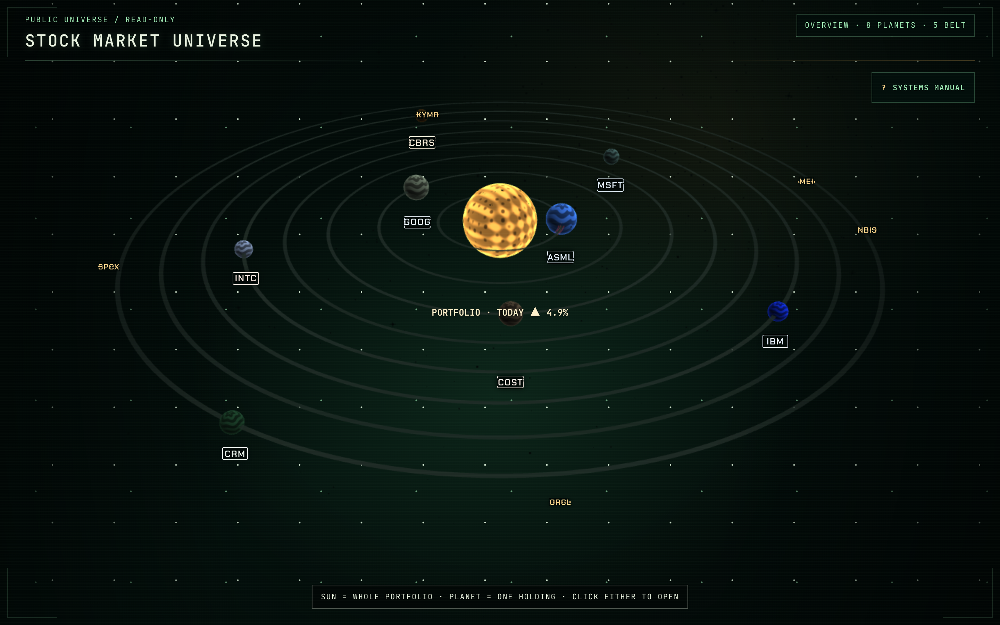

### 2. mission-control — FB-05 legibility and FB-21 space use

**Question: can you read Mission Control without squinting, and does it feel
like it's using the space it has?**

Headers/question copy/holdings text moved off the 11px label token onto
13–15px body/title tokens (role-mapped, not a value nudge). Content column
widened `min(1120px,...) → min(1400px, 96vw)`.

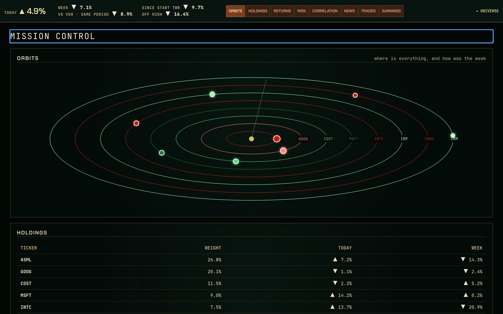

### 3. mission-control-before — FB-21 before/after

**Question: compared to the old, narrower column — does the new width read
as filled rather than cramped?**

The prior `1120px` width, same data, same viewport, for direct comparison
against frame 2.

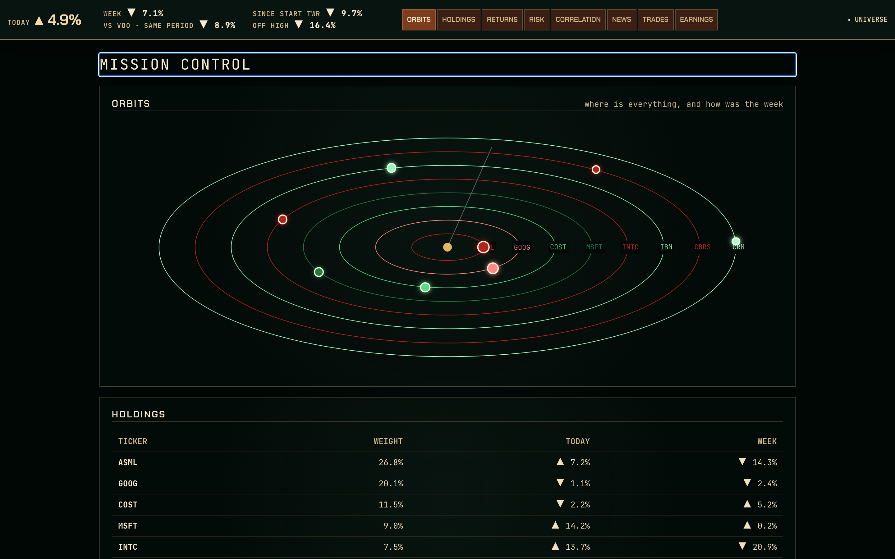

### 4. panel-width-600 — FB-17 (narrowest of three)

**Question: which of these three panel widths do you want to keep?**

Planet stays fully clear of the panel at every width (`unoccluded: true`);
planet position is stable across all three (not moved by the panel).

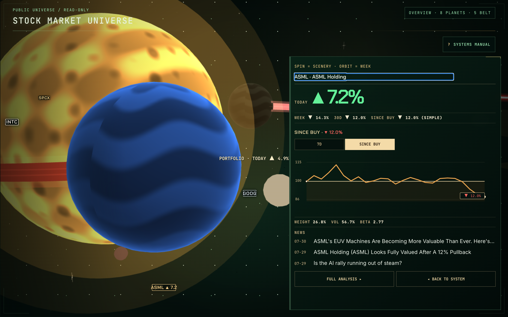

### 5. panel-width-660 — FB-17 (middle)

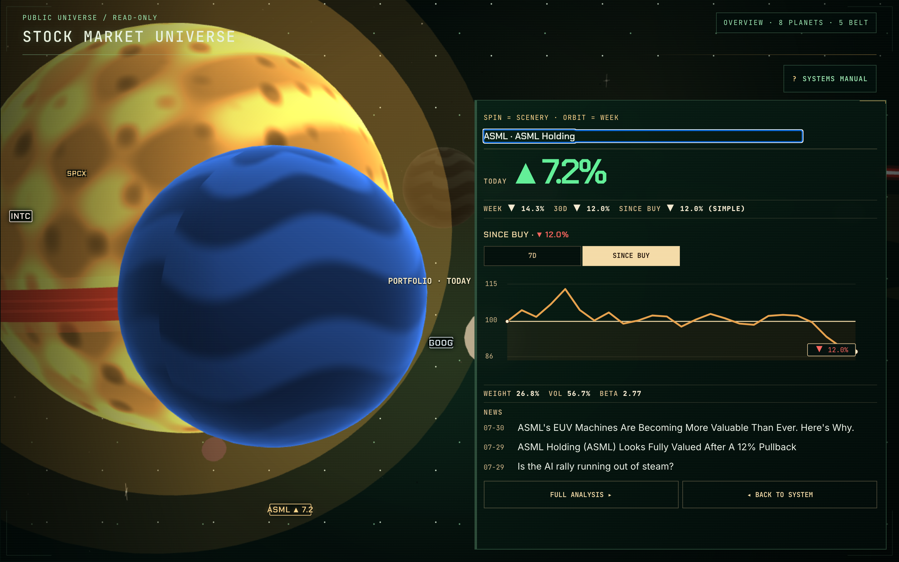

### 6. panel-width-720 — FB-17 (widest of three)

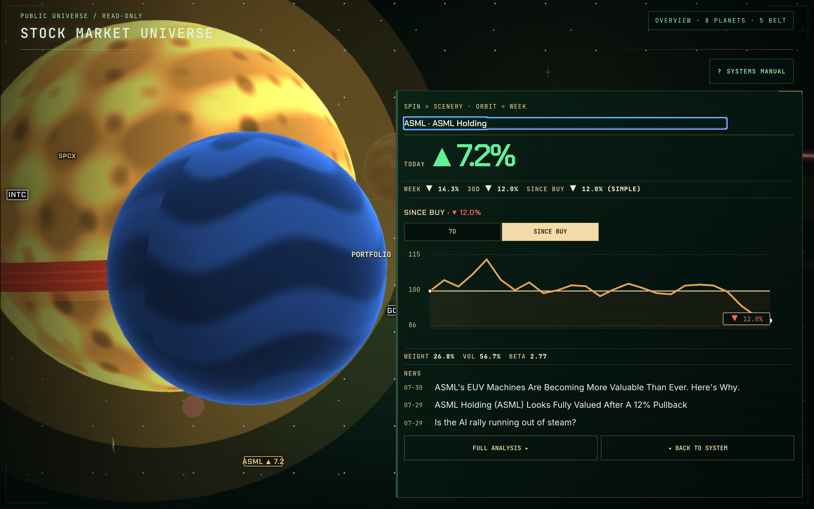

### 7. tab-strip-a — FB-08/FB-15 (no tabs, folded chips)

**Question: which tab-strip treatment do you want — and does removing the
boxes (variant B) read better than keeping them?**

All three variants: 0 console errors, every destination reachable, fully
keyboard-operable.

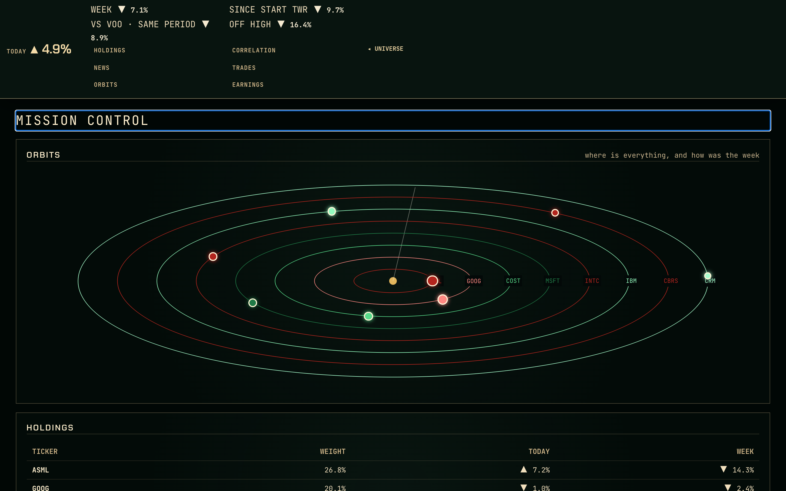

### 8. tab-strip-b — FB-08/FB-15 (boxless black rail — also the FB-15 answer)

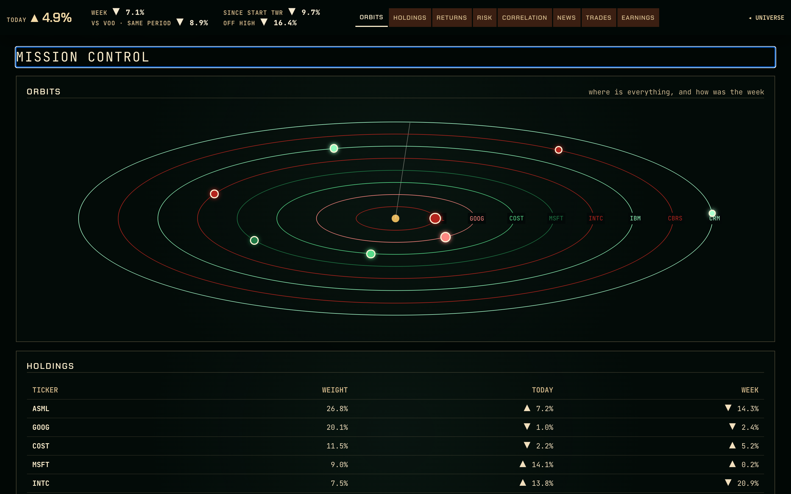

### 9. tab-strip-c — FB-08/FB-15 (vertical index edge)

Rough edge noted honestly: the fixed index sits close to the sticky title bar
at 1440×900 — a cosmetic note on a parked, no-ranking variant, not a defect.

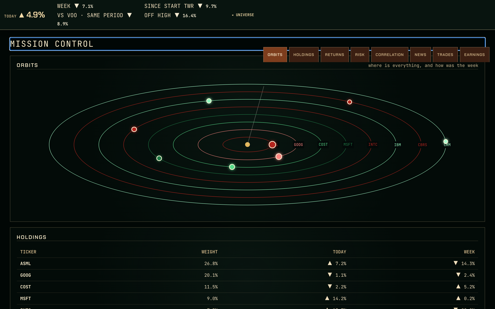

### 10. exit-receipt — FB-09 (the sign-off card)

**Question: is this what you meant instead of the terminal springing open
when you leave Mission Control?**

Four lines, 17 words, phosphor `#e8f1df` on void. Fades after 4s (persists
under reduced motion). The full regrouped terminal (`BODIES · INSTRUMENTS ·
BELT · ENCODING`, ≤9 visible rows, accordion) remains for keyboard/AT users —
see `exit-terminal-grouped-1440x900.png` (not repeated here to hold the
12-frame cap; same row, second half of the same fix).

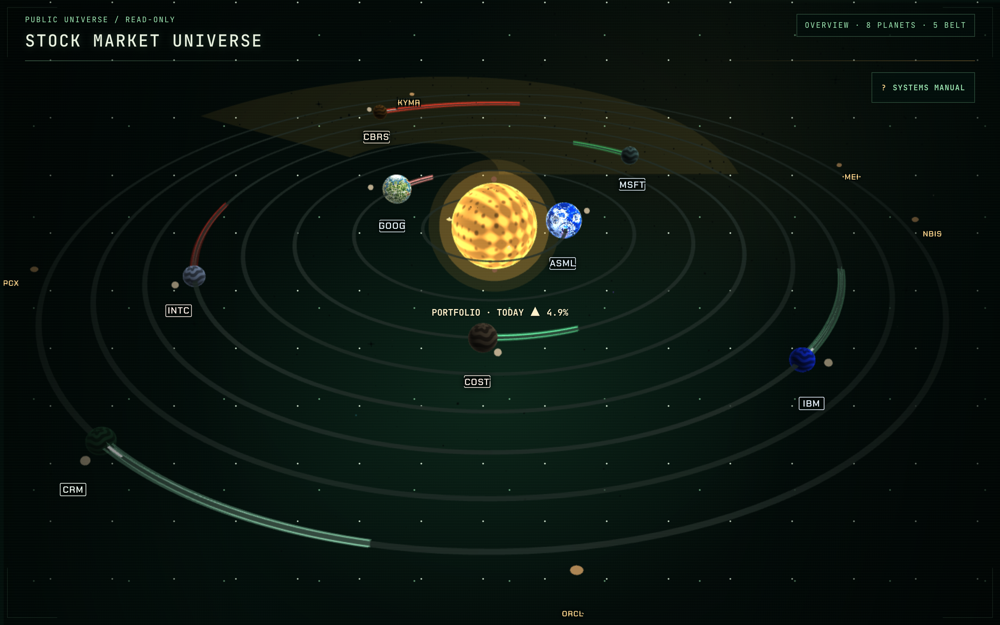

### 11. draft-rig — FB-12 (owner-only capture, reviewer-authenticated)

**Question: does the DRAFT rig feel resolved now — open it, does it make
sense, do you understand what to do?**

Captured by Claude Lead this review turn via a self-chosen temporary
`OWNER_PASSWORD` process override (no `.env*` contents read — same pattern as
§1's acceptance remediation). MOTION defaults OFF, latch present in the strip
nav, coach line reads on first open. Real portfolio, 8 holdings.

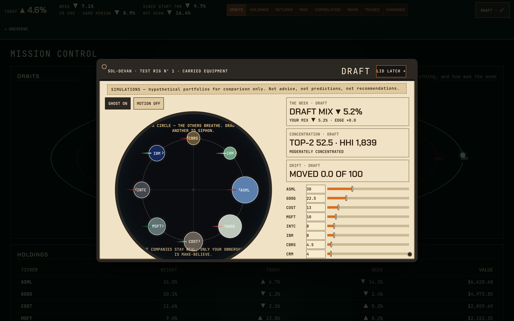

### 12. correlation — FB-11 (the named-pair sentence)

**Question: does this sentence tell you something real and useful about your
own book?**

"COST AND MSFT MOVED TOGETHER ON MOST SHARED DAYS — ONE BET, TWICE." Real
production data, beneath the existing generic paragraph (additive).

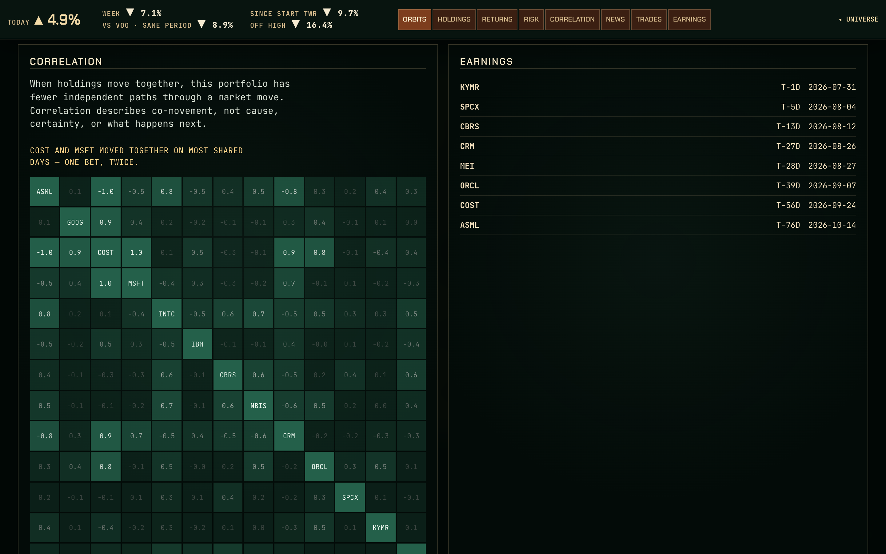

---

12/12 image frames (cap). Regression evidence not included as sitting frames
(no owner judgment needed): `fallback-390x844.png` (MOB-01, mobile fallback
unaffected), `raw-prv01-share-canary.txt` (PRV-01, no new public data path).

Complete.
