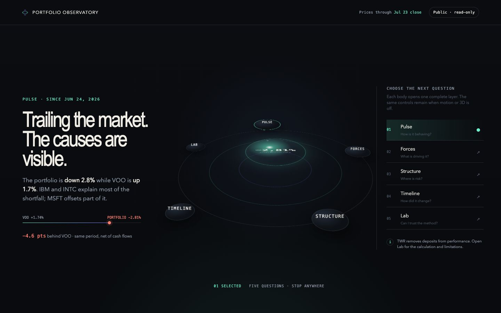
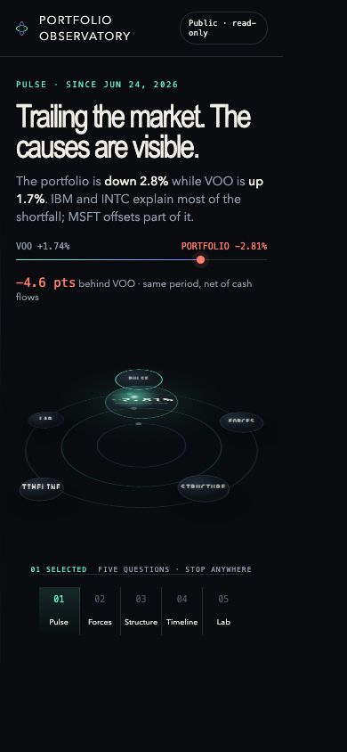
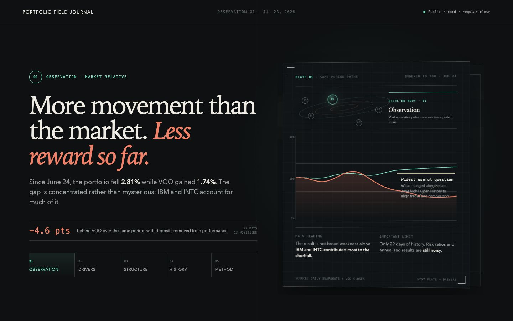
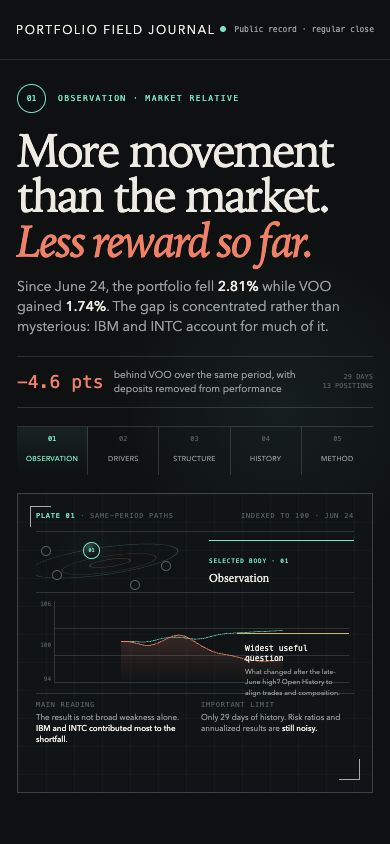
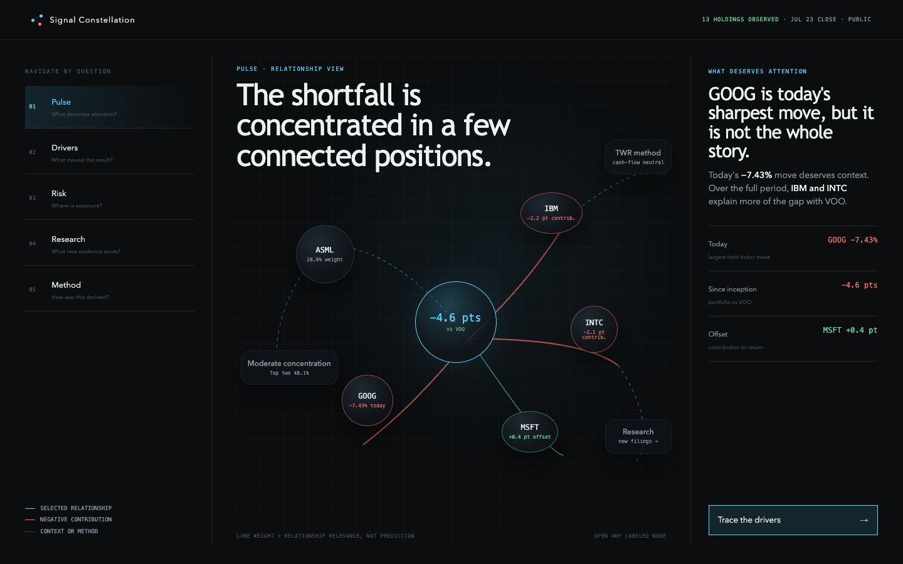
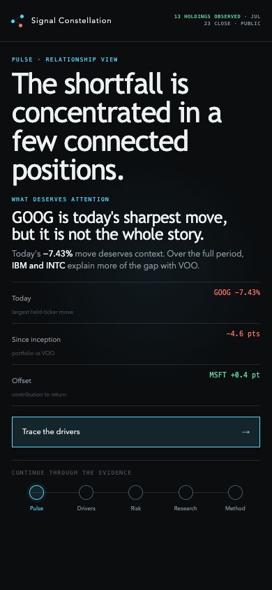

# Phase 10 Dark Design Directions

These are three non-production concept directions for the public `/share`
overview. All use the same representative, honest portfolio state:

- portfolio TWR: −2.81% since June 24, 2026;
- VOO same-period return: +1.74%;
- market-relative gap: −4.55 points, displayed as 4.6 points;
- weekly result: down 1.8%, behind the market;
- 13 positions, led by ASML at approximately 28.9%;
- top two holdings: approximately 48.1%;
- current concentration: moderate (HHI 1558);
- selected driver context: IBM and INTC explain much of the inception
  shortfall, while MSFT offsets part; GOOG is the current top mover at −7.43%.

The typography, color values, and component mechanics in these mockups are
illustrative. Selecting a direction chooses its hierarchy, spatial grammar, and
disclosure model—not immutable tokens or a 3D library.

## Selection recorded — July 23, 2026

**Structural base:** Field Journal

**Field Journal parts retained:**

- editorial market-relative lead;
- observation-plate chapter stack;
- evidence marginalia;
- annotated divergence ribbon.

**Night Orbit parts borrowed:**

- orbital chapter navigation;
- selected-body inspector;
- static concentric fallback.

**Interaction contract:** the orbit selects a numbered observation plate; it
does not become a second competing information system. The selected-body
inspector explains the active chapter, and the concentric fallback carries the
same state when 3D or motion is unavailable.

**Desired first viewport, recorded from Devan:**

> Wow the user interface of this website is incredibly unique with a sense of
> vastness and simpleness to use without traditional remnants of artificial
> intelligence work product. I feel that the person who made this website is
> incredibly creative with a strong interest in space and extraterrestrials,
> but very aware of the market and economic status of the world.

The selected direction removes the design-choice blocker. Production work is
not authorized or started by this record; Phase 10 §0 baseline and state setup
remain the next implementation step.

## At a glance

| Direction | First-viewport immersion | Spatial navigation | Information progression | Editorial ↔ technical | Motion posture | Primary strength | Primary risk |
|---|---|---|---|---|---|---|---|
| [Night Orbit](./night-orbit/README.md) | High | Five labeled orbital bodies around one live pulse | Pulse → Forces → Structure → Timeline → Lab | Balanced | One entry descent + chapter orbit | Most memorable expression of the Observatory | Spatial layer needs disciplined fallback and performance bounds |
| [Field Journal](./field-journal/README.md) | Medium/low | Five stacked observation plates/folios | Editorial finding → evidence plate → marginalia → method | Most editorial | Plate change + restrained chart reveal | Fastest recruiter comprehension and strongest writing hierarchy | May feel less like a world if depth becomes too subtle |
| [Signal Constellation](./signal-constellation/README.md) | Medium/high | A network of holdings, forces, and question nodes | Attention signal → relationship map → selected evidence → method | Most technical | Network assembly + focus transition | Best demonstration of data relationships and exploratory craft | Highest complexity and strongest temptation to overbuild |

## Direction 1 — Night Orbit

The portfolio pulse sits inside a navigable orrery. Each body is a real chapter,
and the selected orbit controls one primary stage. It is the boldest and most
immersive option.

Named parts available to combine:

- orbital chapter navigation;
- market-gap trajectory rail;
- selected-body inspector;
- static concentric fallback.

## Direction 2 — Field Journal

The portfolio reads like a dark editorial research instrument. Five layered
observation plates create depth while the lead sentence and evidence remain
immediately legible. It is the most restrained and professional option.

Named parts available to combine:

- editorial market-relative lead;
- observation-plate chapter stack;
- evidence marginalia;
- annotated divergence ribbon.

## Direction 3 — Signal Constellation

The first view is a relationship map: holdings connect to the forces and
questions they affect. Selecting a node opens a plain-language inspector. It is
the most exploratory and data-science-forward option.

Named parts available to combine:

- relationship-map navigation;
- “what deserves attention” inspector;
- contribution links;
- mobile signal trail.

## Selection rationale

The selection followed this decision rule:

1. **Night Orbit** if the signature should be entering and navigating a spatial
   Observatory.
2. **Field Journal** if recruiter comprehension and editorial confidence should
   lead, with dimensionality as a supporting layer.
3. **Signal Constellation** if relationships among holdings, drivers, and
   methods should be the signature.

Borrowed parts remain intentionally bounded. Signal Constellation is not folded
into the selected direction; its graph model would compete with the editorial
plates and orbital index.

The selection above is now recorded. Phase 10 implementation still begins only
through §0 baseline and handoff-state setup.

## Prototype files

- [Night Orbit static mockup](./night-orbit/overview.html)
- [Field Journal static mockup](./field-journal/overview.html)
- [Signal Constellation static mockup](./signal-constellation/overview.html)

These files are planning artifacts only. They fetch no portfolio data, add no
dependencies, and do not alter production routes or components.
